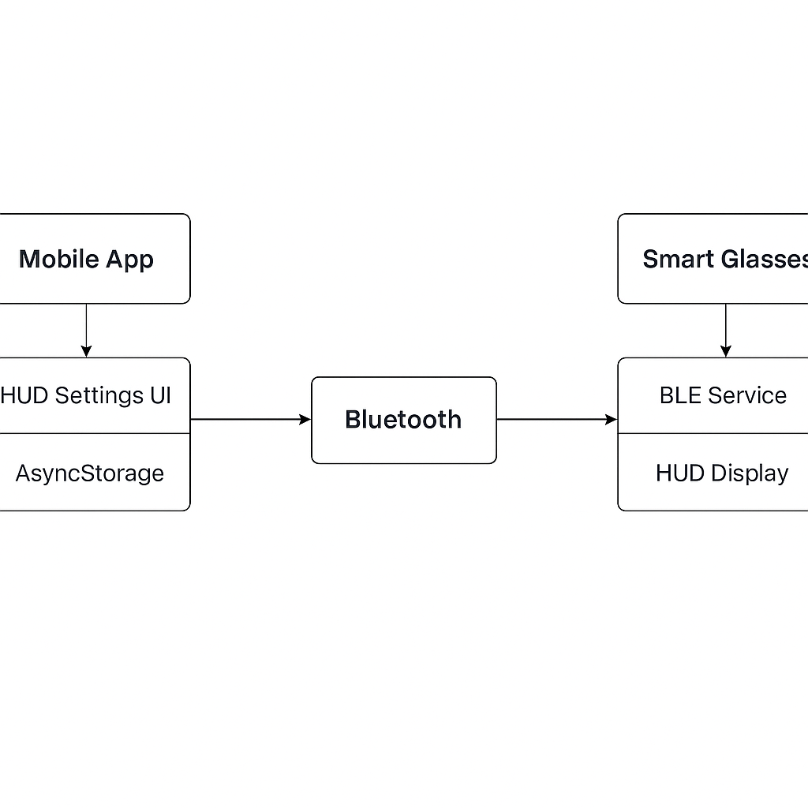
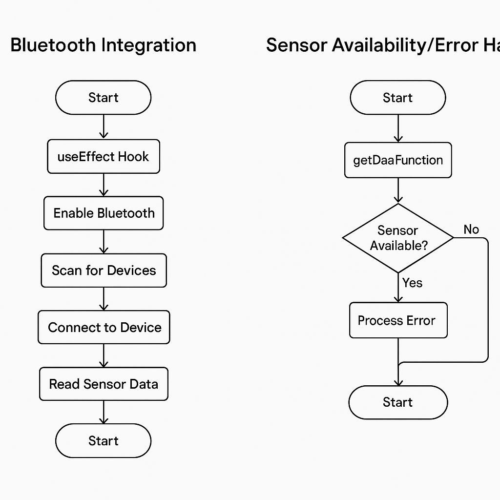
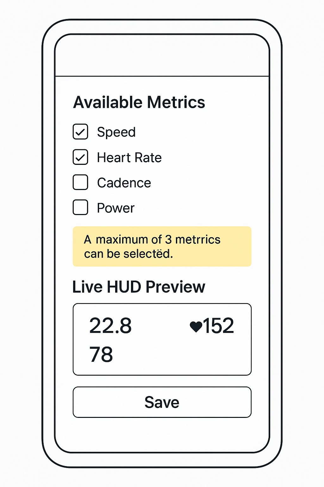

# Customizable HUD for Smart Cycling Glasses

This project demonstrates a customizable heads-up display (HUD) for smart cycling glasses, allowing users to control which performance metrics appear during a ride.

The core idea is to let cyclists use a web interface to select and customize the metrics they want to see (e.g., speed, heart rate, cadence, power). These preferences are stored locally and can be transmitted via Bluetooth Low Energy (BLE) to smart glasses, which render the chosen data in real-time.

## Why This Project

Customizability enhances user experience. Instead of showing the same fixed stats for everyone, this feature gives each rider the ability to define what's most important to them. The UI was built with simplicity in mind—easy metric selection and a preview panel for reassurance before riding.

Repo: [https://github.com/ryannnsevidal/customizable-hud](https://github.com/ryannnsevidal/customizable-hud)

## System Architecture

```
+--------------------+           Bluetooth           +--------------------+
|     Web App        | <--------------------------> |   Smart Glasses     |
+--------------------+                              +--------------------+
        |                                                  ^
        | (Local Storage)                                  |
        v                                                  |
+------------------------+                          +----------------------+
| HUD Settings Component |                          |   BLE GATT Service   |
+------------------------+                          |  - Accepts config    |
        |                                            |  - Displays metrics  |
        v                                            +----------------------+
+-------------------------------+
| HUD Preview / Simulated Data |
+-------------------------------+
```

## Feature Workflow

1. **Initialization**  
   The user launches the web app and navigates to the HUD settings page. A list of metrics is displayed.

2. **User Selection**  
   Multiple metrics can be selected. A HUD preview updates in real-time to reflect choices.

3. **Configuration Storage**  
   User choices are saved using `localStorage` in this format:
   ```json
   {
     "hudMetrics": ["speed", "heartRate", "cadence", "power"]
   }
   ```

4. **Bluetooth Sync**  
   Once the smart glasses are powered and connected, the app:
   - Scans and connects via BLE
   - Discovers GATT services
   - Writes the selected metrics to a writable characteristic

5. **Ride Time**  
   During the ride, the app streams real-time data to the glasses. Only the selected metrics are shown.

6. **Handling Edge Cases**  
   If a selected metric isn’t available (e.g., power meter is missing), it is substituted with a default. If the Bluetooth connection drops, the last known config is preserved or an alert is issued.

## HUD Preview Example

```
+--------------------------+
| SPEED: 22.5 km/h         |
| HEART RATE: 145 bpm      |
| CADENCE: 88 rpm          |
+--------------------------+
```

## Bluetooth Implementation

This project uses the Web Bluetooth API for BLE functionality.

### Scan and Connect
```js
navigator.bluetooth.requestDevice({
  filters: [{ namePrefix: 'EraGlasses' }],
  optionalServices: ['hud-service-uuid']
}).then(device => {
  return device.gatt.connect();
}).then(server => {
  return server.getPrimaryService('hud-service-uuid');
});
```

### Transmit HUD Configuration
```js
const configJSON = JSON.stringify({ 
  hudMetrics: ["speed", "heartRate", "cadence", "power"] 
});
const encoder = new TextEncoder();
const data = encoder.encode(configJSON);

await characteristic.writeValue(data);
```

## Sensor Availability Check

Before sending configuration to the glasses, the app checks whether selected metrics are supported by available sensors.

Example logic:
```js
const isSensorAvailable = (sensorType) =>
  connectedDevices.some((device) => device.name.includes(sensorType));

const validatedMetrics = selectedMetrics.filter(isSensorAvailable);
```

## Simulated Data (for Preview Testing)

To demonstrate HUD updates without real sensors, random values are generated:

```js
useEffect(() => {
  const interval = setInterval(() => {
    setPreviewData({
      speed: (Math.random() * 40).toFixed(1),
      heart_rate: Math.floor(Math.random() * 70 + 100),
      cadence: Math.floor(Math.random() * 90 + 60),
    });
  }, 1000);
  return () => clearInterval(interval);
}, []);
```

## Tech Stack and Decisions

| Layer         | Technology             | Reason                                |
|---------------|-------------------------|----------------------------------------|
| Frontend      | React + TypeScript      | Modern web tech, supports Web Bluetooth|
| UI Library    | Tailwind CSS + shadcn  | Beautiful, customizable components     |
| Storage       | localStorage            | Persistent browser storage             |
| Bluetooth API | Web Bluetooth API       | Native browser BLE support             |
| Build Tool    | Vite                    | Fast development and building          |
| Format        | JSON                    | Readable and easy to encode/decode     |

## Getting Started

### Prerequisites
- Node.js 18+ 
- npm or yarn

### Installation
```bash
cd /workspaces/customizable-hud/front_end/back_end/both
npm install
```

### Development
```bash
npm run dev
```

### Build for Production
```bash
npm run build
```

### Docker Deployment
```bash
docker-compose up --build
```

## Next Steps / In Progress

- BLE UUIDs to be finalized using the Era SDK or GATT explorer
- Real sensor data integration
- Additional error handling for mid-ride disconnects

## For Reviewers

This repo contains the web-based HUD customization interface and preview logic. Web Bluetooth connection and configuration sync logic is implemented and ready for integration with compatible smart glasses. The UX is structured to be intuitive and clean, especially for riders adjusting settings before their ride.

The application features:
- Real-time HUD preview with simulated cycling data
- Customizable metric selection (speed, heart rate, cadence, power)
- Multiple layout options (grid, horizontal, vertical, compact)
- Bluetooth integration capabilities
- Docker containerization for easy deployment

If you'd like additional features added or this turned into a demo-ready deployment, feel free to request it.
